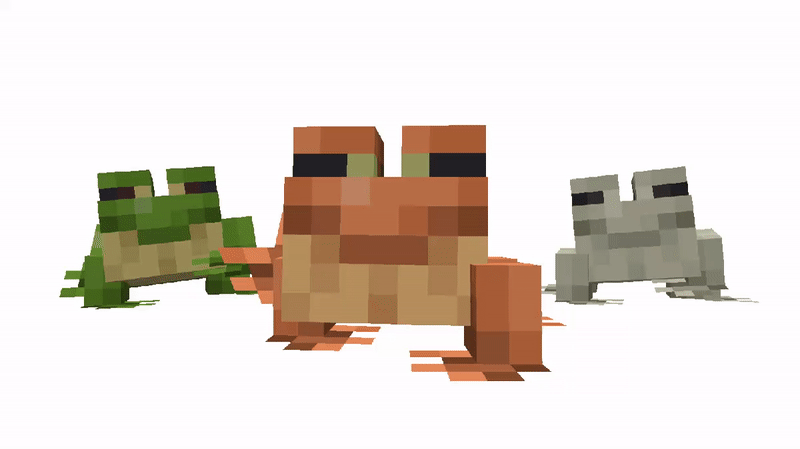

<html lang="en">
<head>
    <meta charset="UTF-8">
    <meta name="viewport" content="width=device-width, initial-scale=1.0">
    
</head>
<body>

    

    

    

    

    <h1>I'm Ondřej Mišák</h1>
    
As a designer, I’m passionate about creating beautiful, modern, and functional digital experiences. Let's connect and build something amazing together.

    

        <a href="mailto:misak.ondrej@email.cz" class="button">Contact Me</a>
        <a href="https://www.figma.com/design/0YlSm7hb7xT16KIkEb62Of/Portfolio?node-id=0-1" class="button" target="_blank">View Portfolio</a>
    

    
Here’s some additional information about my interests:

    <ul>
        <li>Web Design</li>
        <li>User Experience</li>
        <li>Graphic Design</li>
        <li>Photography</li>
    </ul>

    
Check out the following table for my skills:

    <table>
        <thead>
            <tr>
                <th>Skills</th>
                <th>Tools</th>
            </tr>
        </thead>
        <tbody>
            <tr>
                <td>Branding + Product Design</td>
                <td>Adobe Photoshop</td>
            </tr>
            <tr>
                <td>Digital Media Design</td>
                <td>Adobe Illustrator</td>
            </tr>
            <tr>
                <td>Wireframing</td>
                <td>Adobe Premiere Pro</td>
            </tr>
            <tr>
                <td>Graphic Design</td>
                <td>Adobe InDesign</td>
            </tr>
            <tr>
                <td>Digital Art and Illustration</td>
                <td>Adobe After Effects</td>
            </tr>
            <tr>
                <td>Social Media Management</td>
                <td>Microsoft 365</td>
            </tr>
            <tr>
                <td>Creativity</td>
                <td>Figma</td>
            </tr>
            <tr>
                <td></td>
                <td>Clip Studio</td>
            </tr>
            <tr>
                <td></td>
                <td>Blender</td>
            </tr>
            <tr>
                <td></td>
                <td>Sketch</td>
            </tr>
        </tbody>
    </table>

    
Enjoy this funny GIF!

    

</body>
</html>
