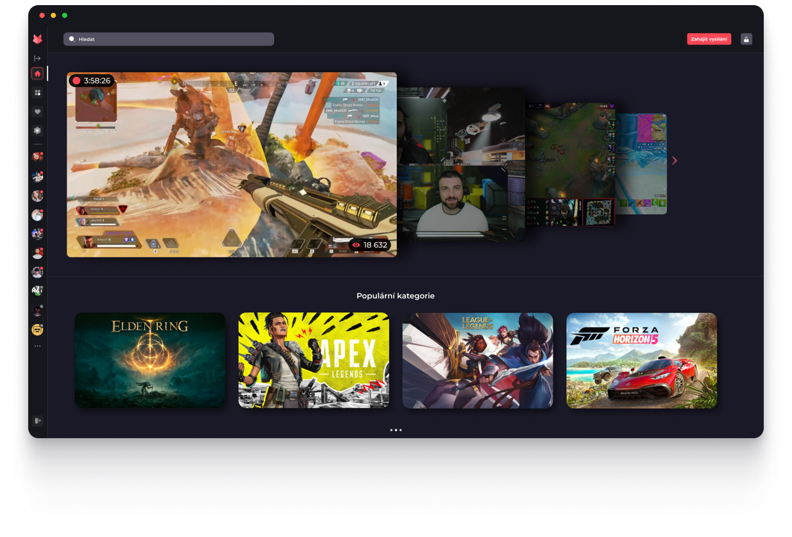
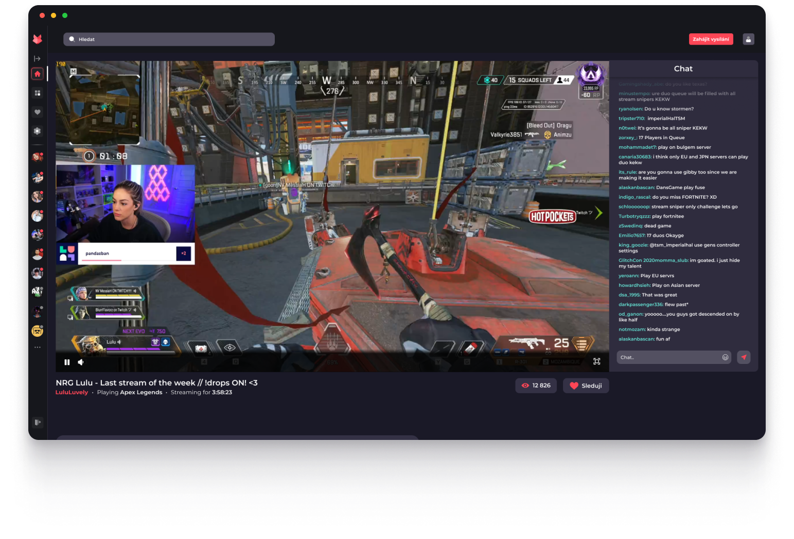
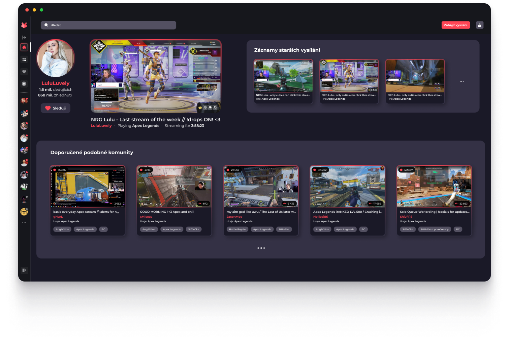
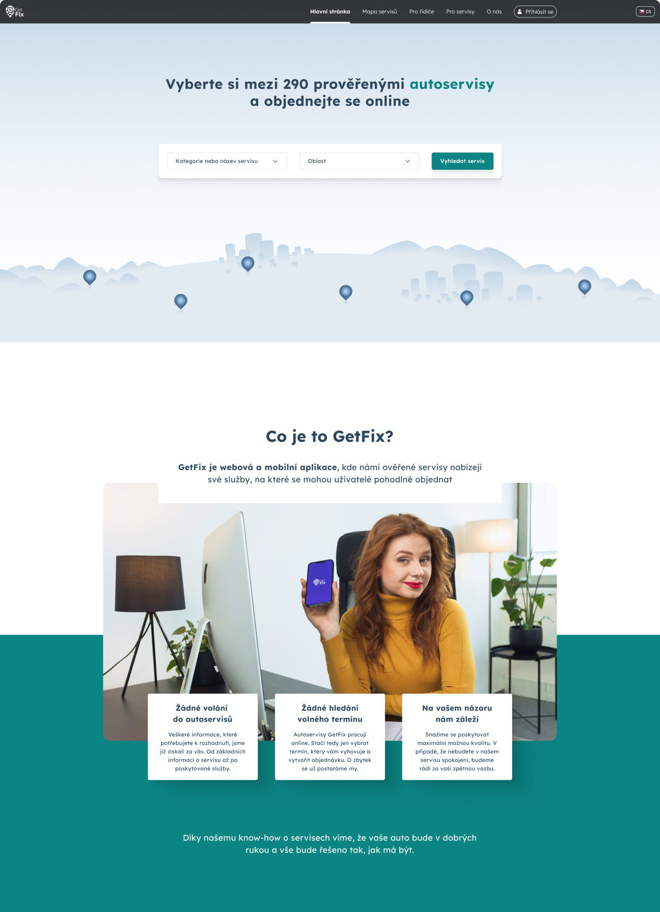

# Welcome

My name is Ondřej Mišák. A UX/UI designer creating intuitive and visually engaging digital experiences.

## About me

Curretly writing my bachelor's at School of Creative Communication. I decided to pursue Design, because I love creating meaningful stuff. To me, design needs to give people an experience that also solves a problem.

I want to create something that is entertaining. Making people engaged in the design. Wanting them to explore it, but also being easy to understand, and user-friendly. I mainly focus on UX/UI Design, but I don't mind doing other designer work as well.

> “Design is a process that focuses on creating enjoyable experiences by understanding what users want and needs.”” — *Jesse Schell*

# Some stuff I worked on:
If you wanna look at full portfolio you can find it here: [LINK](https://www.figma.com/design/0YlSm7hb7xT16KIkEb62Of/Portfolio?node-id=0-1)

## Streaming platform Ketu

Streaming platform page design focused on an intuitive, visually engaging experience. The layout emphasizes seamless navigation and vibrant visuals that reflect the variety of content available.

The design combines cinematic imagery with smooth interactions, making it easy and enjoyable for users to discover new stories.

## Getfix landing page

Landing page design crafted to captivate and guide users effortlessly. The layout is clean and engaging, with bold visuals and clear calls to action that highlight key features.

## Logo design

Logo design focused on simplicity and memorability, capturing the essence of the brand with clean lines and bold shapes.
