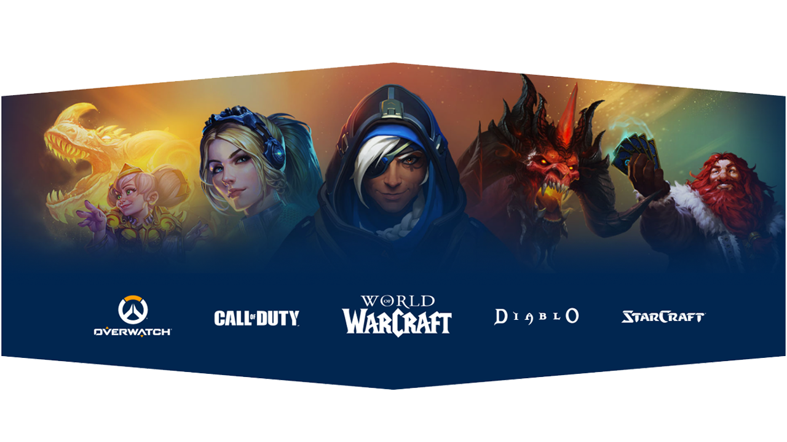
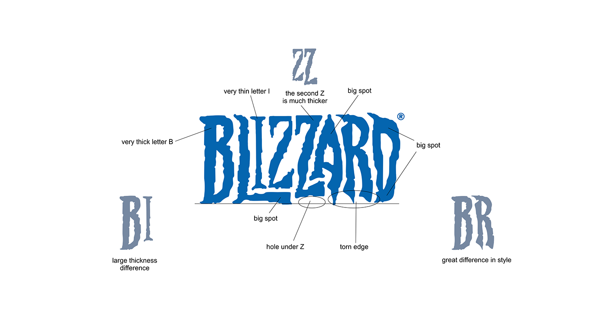

# Birth of an Icon: The Journey to a Memorable Logo

## The Spark: Finding Inspiration in the Brief  
Activision Blizzard, a global gaming giant formed in 2008 from the merger of Activision and Blizzard Entertainment, needed a logo refresh to reflect its evolving identity.  

With Microsoft’s 2023 acquisition and a $73 billion valuation, the brief was clear:  
**Create a design that honors its legacy while appealing to a diverse audience.**  

---

# Drawing Identity: How a Logo Tells a Story

## Lines and Curves: Sketching the First Impressions  
The old logo felt dated for a company at the forefront of the gaming industry.  
Initial sketches focused on shedding the frosty vibe, introducing dynamic shapes to capture the energy of a competitive market.  

## Beyond the Line: Crafting a Visual Fingerprint  

### Color & Soul: Infusing Personality into Design  
The new logo embraced **bold, modern hues** and **fluid forms** to reflect innovation and accessibility.  
The design spoke to a broader audience while retaining a nod to Blizzard’s heritage.  
It became a **visual signature**, standing out in a sea of competitors.  

---

# The Power of Simplicity: The Art of Logo Design

## Refining the Edge: Iterations That Define Success  
Through multiple iterations, the design stripped away complexity to achieve clarity and impact.  
The goal was to **boost brand awareness and sales.**  
The final logo modernized Activision Blizzard’s image, fostering trust and appealing to players across all age groups in a fiercely competitive industry.  

---

# From Vision to Victory: Building a Brand’s Face

## The Final Reveal: A Logo That Speaks Volumes  
The rebrand delivered:  
- **Heightened brand recognition**  
- **Increased sales**  
- **A stronger market position against gaming giants**  

It opened doors to new markets, improved investor confidence, and sparked media buzz.  
Internally, it revitalized company culture, aligning with Activision Blizzard’s push for innovation and cementing its edge in the ever-evolving gaming world.  
